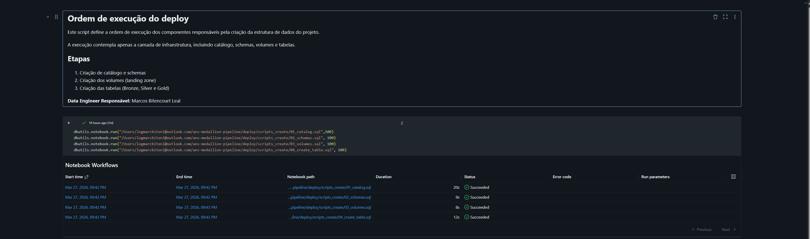
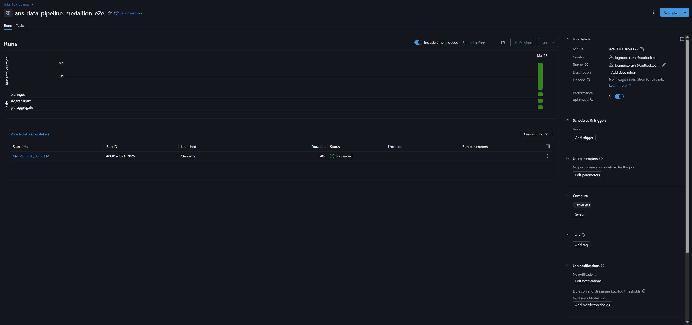
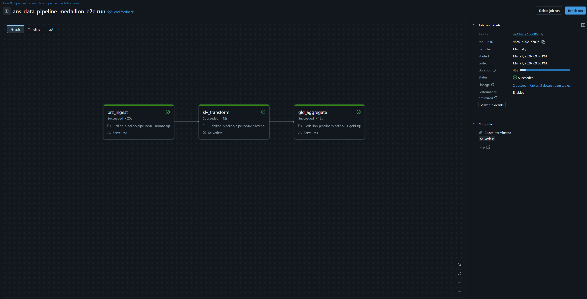
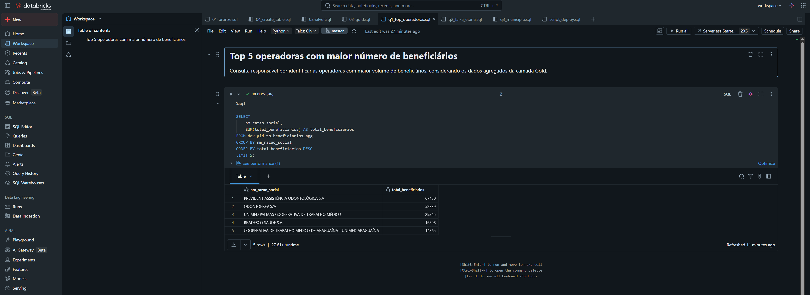
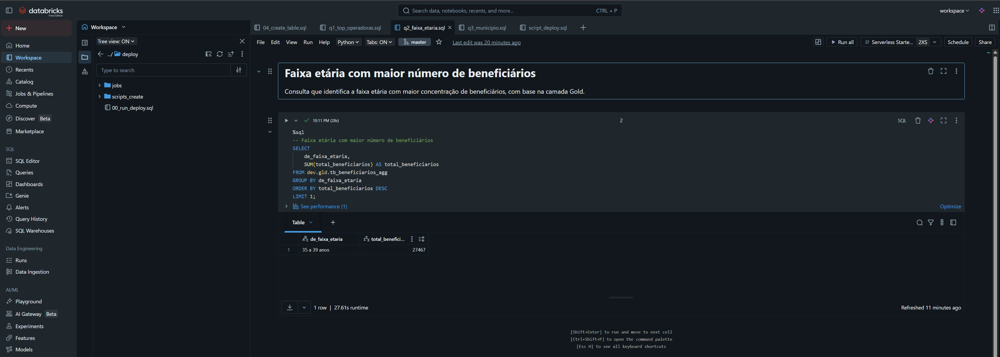
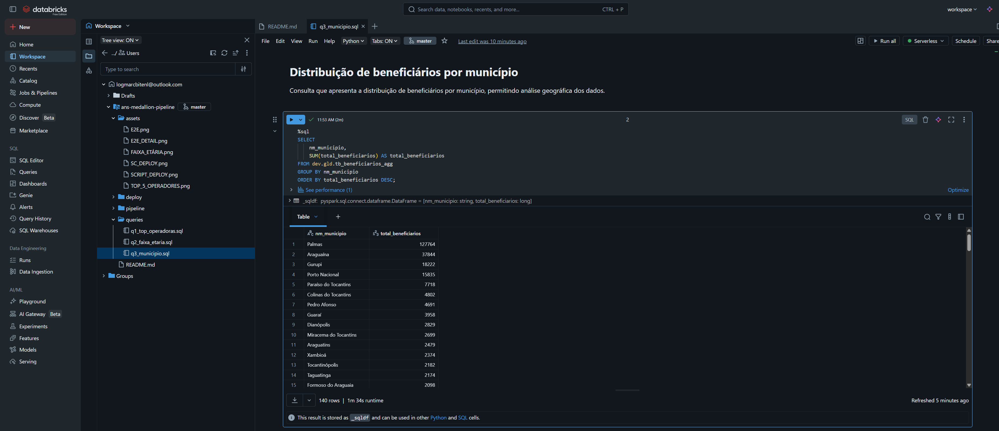

# 📊 ANS Data Pipeline – Medallion Architecture


---

## 📌 Objetivo

Este projeto implementa um pipeline de dados baseado na arquitetura **Medallion (Bronze, Silver e Gold)** utilizando SQL no Databricks.

A solução foi desenvolvida com base no desafio técnico proposto no documento:

👉 *Desafio Técnico – Engenheiro de Dados* 

O objetivo é processar dados públicos da ANS (Agência Nacional de Saúde Suplementar) e disponibilizá-los para consumo analítico, seguindo boas práticas de engenharia de dados.

---

## 📂 Fonte de Dados

O pipeline utiliza o arquivo:

```text
pda-024-icb-TO-2025_08.csv
```

Este arquivo foi disponibilizado conforme especificado no documento do desafio técnico.

---

## 🏗️ Arquitetura do Pipeline

O pipeline foi estruturado em três camadas:

### 🥉 Bronze (Raw Layer)

* Ingestão do arquivo CSV no formato original (“as-is”)
* Uso de `COPY INTO` para ingestão incremental
* Inclusão de metadados:

  * `dt_ingestao`
  * `nm_arquivo`

A escolha do `COPY INTO` garante que, caso novos arquivos sejam adicionados ao volume, não haverá risco de reprocessamento de arquivos já ingeridos.
**"COPY INTO evita que o mesmo arquivo seja ingestionado várias vezes, garantindo controle de incrementalidade."**

---

### 🥈 Silver (Refined Layer)

* Tipagem de colunas
* Padronização dos dados
* Estruturação em formato Delta

---

### 🥇 Gold (Curated Layer)

* Agregações para consumo analítico
* Otimização de performance

---

## 📂 Estrutura do Projeto

```
ans-medallion-pipeline/
│
├── deploy/
│   ├── jobs/
│   │   └── ans_data_pipeline_medallion_e2e.json
│   │
│   ├── scripts_create/
│   │   ├── 01_catalog.sql
│   │   ├── 02_schemas.sql
│   │   ├── 03_volumes.sql
│   │   └── 04_create_table.sql
│   │
│   └── 00_run_deploy.sql
│
├── pipeline/
│   ├── 01-bronze.sql
│   ├── 02-silver.sql
│   └── 03-gold.sql
│
├── queries/
│   ├── q1_top_operadoras.sql
│   ├── q2_faixa_etaria.sql
│   └── q3_municipio.sql
│
├── assets/
│   ├── image_1774660898040.png
│   ├── image_1774660946232.png
│   ├── image_1774660991767.png
│   ├── image_1774661037625.png
│   ├── image_1774661068132.png
│   └── image_1774661179983.png
│
└── README.md
```

---

# ⚙️ Guia de Execução (Passo a Passo)

## 🔧 1. Executar o Deploy (OBRIGATÓRIO)

Antes de rodar o pipeline, é necessário criar toda a infraestrutura:



Este script cria:

* Catálogo
* Schemas
* Volumes
* Tabelas (Bronze, Silver e Gold)

---

## 📥 2. Upload do Arquivo

Realizar o upload do arquivo CSV no seguinte caminho:

```text
/Volumes/dev/brz/vl_landing/
```

---

## 🔄 3. Executar o Workflow

Executar o job no Databricks seguindo a ordem:

```text
brz_ingest → slv_transform → gld_aggregate
```

---

## 📸 Evidência de Execução






---

# 📊 Consultas Analíticas

## 🥇 Top 5 operadoras com maior número de beneficiários

* Agrupamento por operadora
* Ordenação decrescente
* Limite de 5


---

## 🥈 Faixa etária com maior número de beneficiários

* Identificação da faixa com maior volume
* Retorno direto do maior valor



---

## 🥉 Beneficiários por município

* Agrupamento por município
* Ordenação decrescente
* Retorno completo dos municípios



---

# 🚀 Boas Práticas Aplicadas

* Arquitetura Medallion
* Separação por camadas
* Uso de `COPY INTO` para ingestão incremental
* Uso de Delta Lake
* Organização modular dos scripts
* Orquestração via workflow

---

## 🧠 Decisões de Engenharia

Durante o desenvolvimento do pipeline, algumas decisões técnicas foram tomadas com foco em eficiência e boas práticas:

### 🔹 Particionamento

Optou-se por não particionar as tabelas, pois o volume de dados é relativamente pequeno (< 1TB).  
A aplicação de particionamento nesse cenário poderia gerar overhead desnecessário, aumento de arquivos pequenos e degradação de performance em operações de leitura e escrita.

---

### 🔹 Uso de Cache

O uso de cache não foi aplicado, pois o pipeline segue um fluxo linear (Bronze → Silver → Gold), sem reutilização de DataFrames intermediários.  
A aplicação de cache neste caso não traria ganho de performance e poderia gerar consumo desnecessário de memória.

---

### 🔹 Privacidade de Dados (PII)

Após análise do dataset, não foram identificados dados pessoais sensíveis (PII).  
Os dados são agregados por operadora, município e faixa etária, não permitindo a identificação individual de beneficiários.

Dessa forma, não foi necessária a aplicação de técnicas de mascaramento de dados.

# 📌 Observações Importantes

* O deploy deve ser executado antes do pipeline
* O pipeline é reexecutável
* Estrutura preparada para evolução futura (novos arquivos)


